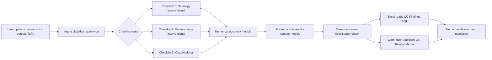

# Stats QC Review Agent Deployment Kit

A practical deployment kit for building a human-in-the-loop statistics QC and review agent in Microsoft Copilot Studio or a similar enterprise agent platform.

The agent is designed to help clinical statistics, statistical programming, medical writing, and quantitative drug development teams review a manuscript against statistical outputs/TLFs, check numerical accuracy, and flag statistical interpretation risks.

## Core philosophy

Do not build a general chatbot. Build a controlled reviewer.

The agent should:

- Act like a seasoned clinical biostatistician.
- Use a curated checklist knowledge base.
- Compare manuscript text, tables, figures, and abstracts against uploaded outputs/TLFs.
- Recalculate simple values such as percentages and differences when source values are available.
- Flag statistical interpretation risks such as unsupported subgroup claims, multiplicity gaps, causal overstatement, or misuse of non-significant results.
- Return structured findings that a human reviewer can verify and resolve.

## Human-in-the-loop disclaimer

This kit is designed for assisted QC and statistical review. It is not designed for automated statistical, medical, regulatory, clinical, or submission sign-off. High-risk or critical findings should be reviewed by a qualified statistician, programming lead, study clinician, medical writer, or regulatory reviewer as appropriate.

Do not upload protected health information, confidential study data, or proprietary client materials into a public repository. Use synthetic examples for public testing.

## Workflow



## What this repo contains

| Path | Purpose |
|---|---|
| `system_instructions.txt` | Copy/paste instructions for the Copilot Studio agent instruction box. |
| `prompts.md` | Short user prompts that work after the agent is configured. |
| `checklists/` | Companion checklist in DOCX, Markdown, and CSV formats. |
| `docs/` | Stepwise setup, knowledge source, output, validation, and governance guidance. |
| `guidance/guidance_urls.md` | Suggested external guidance URLs to add as supporting knowledge. |
| `schema/` | Findings-log schema and data dictionary. |
| `templates/` | QC findings log and review memo templates. |
| `test-data/` | Synthetic manuscript, SAP, and TLF examples with intentional issues. |
| `sample-outputs/` | Expected findings for the synthetic test pack. |
| `assets/` | Workflow diagram source and LinkedIn carousel PDF if included. |

## Quick start

1. Create a new GitHub repository named `stats-qc-review-agent`.
2. Upload this deployment kit.
3. In Copilot Studio, create a new agent named `Stats QC and Review Agent`.
4. Add the companion checklist as the core knowledge source.
5. Add curated guidance URLs as supporting knowledge.
6. Paste `system_instructions.txt` into the agent instructions.
7. Enable file uploads or configure SharePoint/OneDrive study folders.
8. Add the short starter prompts from `prompts.md`.
9. Test with the synthetic files in `test-data/`.
10. Compare the agent output against `sample-outputs/expected_qc_findings_log.csv`.

## Minimum everyday prompt

After configuration, the user should be able to say:

```text
QC this manuscript against the uploaded outputs.
```

The agent should then perform the full workflow: numerical QC, statistical concept review, formatting QC, cross-document consistency, and structured output generation.

## Recommended output package

- `Excel-ready QC Findings Log`: primary working output and issue tracker.
- `Word-style Statistical QC Review Memo`: narrative summary for the study team.
- Optional PDF archive after human review and resolution.

## Suggested repository settings

- Keep the public repo synthetic only.
- Use Issues for rule requests and validation failures.
- Use Releases for stable versions such as `v0.1.0`, `v0.2.0`.
- Use a license only after confirming your intended reuse terms.

## Maintainer checklist

- [ ] Review and approve all checklist content before public release.
- [ ] Remove real study names, sponsor names, patient data, and proprietary values.
- [ ] Confirm license choice.
- [ ] Validate the agent with the synthetic test pack.
- [ ] Add release notes for each checklist or instruction change.
